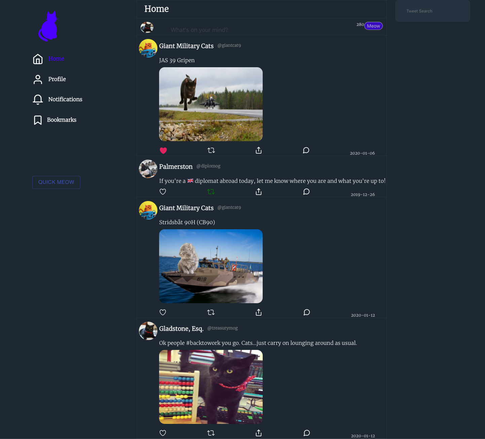
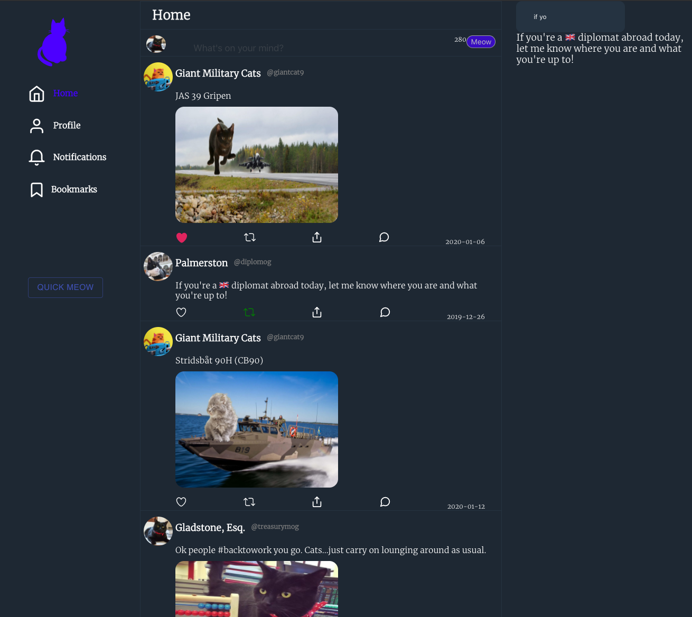
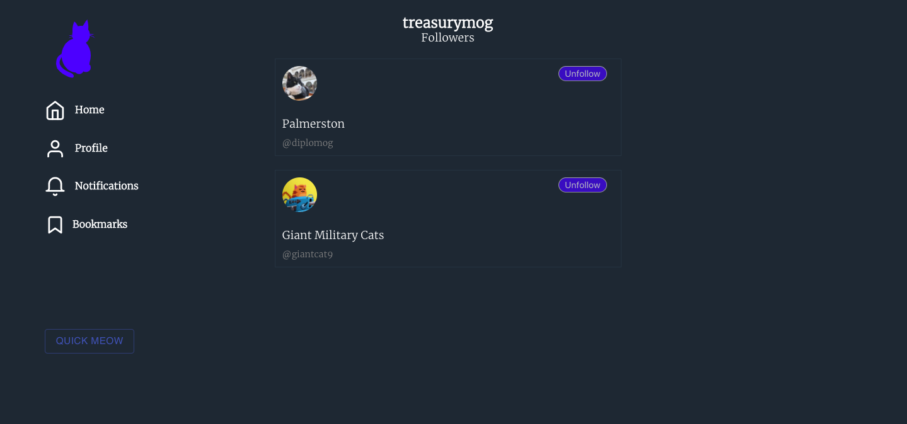
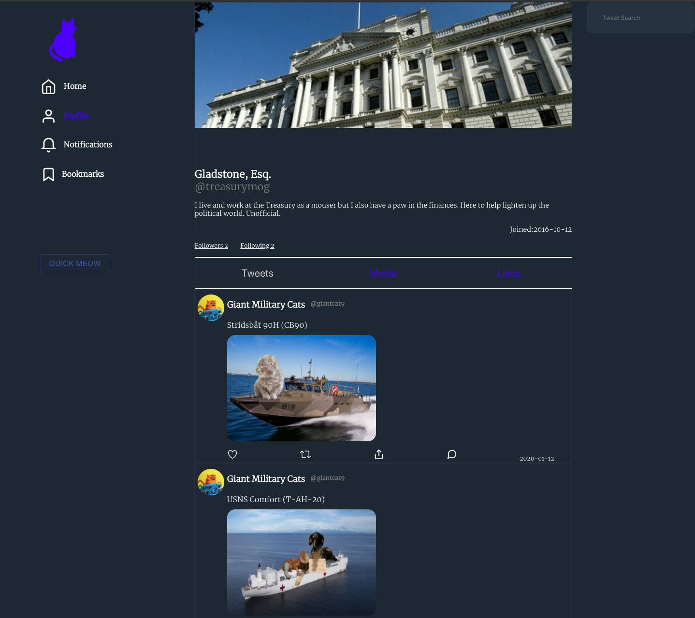

### Project Title
Twitter Clone - Cat edition
Search users, tweet like or retweet their posts or even follow them!

### Getting Started
These instructions will get you a copy of the project up and running on your local machine for development and testing purposes.
Go to the server directory. Run npm install/yarn install followed by npm start/yarn start. The server will be running on port 5678
Go to the workshop directory. Run npm install/yarn install followed by npm start/yarn start. Accept to listen to FE on port 3000

### Flow for user.
Currently signed in as default as GladStone, Esq @treasurymog. Following 2 other users.

## Main User:
- Home tweet feed page:

- Ability to search for tweets

- Ability to follow and unfollow

- Profile page. User's (GladStone) tweet will show up here:

### Built With
Node.js - Backend
React & Styled-components  - FrontEnd

### Known bugs
- Unfollowing and afterwards retweeting a users tweet will cause a bug (Tweet doesn't exist in state).

### Authors
Josh Commeau. 
Scott Morin.
Peter Scardera.

### License
This project is licensed under the MIT License - see the LICENSE.md file for details

